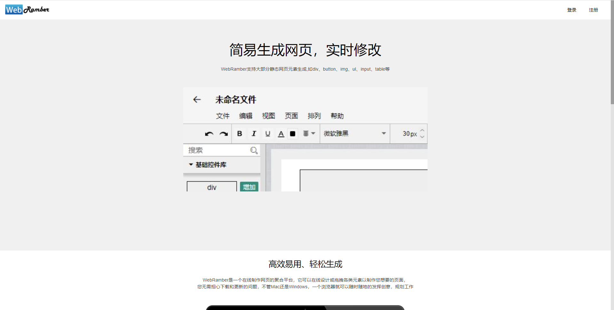

# WebRamber

用于辅助生成简单页面，开发中，仅实现了部分主要功能，大部分次要功能未实现。

## 一、背景
受启发与Processon的操作方式，不同之处在于Processon是用于制作各类图件，WenRamber用于制作简单静态网页。虽然使用了一些开源js，但主要功能仍是用原生js完成的。

## 二、主要功能
+ 通过类似于富文本编辑器的可视化功能完成网页构建。
+ 目前包括：视图的放缩与定位、幕布的风格自定义化、常用静态元素的添加、拖拽拉伸、编辑、删除，大部分文本编辑功能、修改填充及边框样式、元素的层级管理、元素的锁定和匹配、页面的导出等。

## 三、界面展示

## 四、开发进度
实现了框架和部分主要功能，大部分次要功能未实现，正在写毕业论文，暂停开发。
